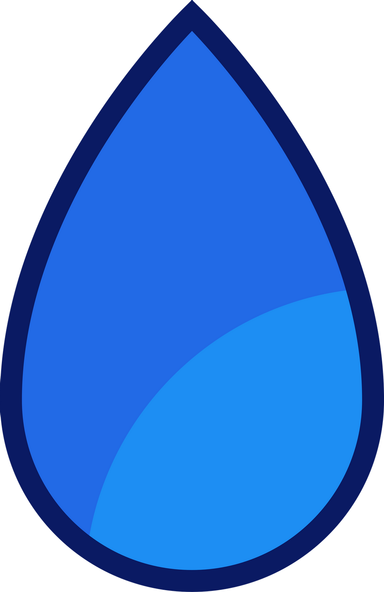

<h3 align="center">
    
</h3>

<p align="center"> :tada: <strong>Lazuli - 4º ADS</strong> 🚧</p>
 
<p align="center">
   
  
  <a href="https://github.com/savio-2-lopes">
    
  </a>
 
 <a href="https://github.com/savio-2-lopes">
    
  </a>
</p>

<br>

## :pushpin: Índice

- [Sobre](#sobre-o-projeto)
- [Como Executar](#executar)
- [Tecnologias](#tecnologias)
- [Licença](#licenca)

<br>

<a id="sobre-o-projeto"></a>

## 💻 Sobre o projeto

 🚀 Browser extension focused on monitoring the user's mental health 
 
<br>

<a id="executar"></a>

## 🚀 Como executar o projeto

### Pré-requisitos

Antes de começar, você vai precisar ter instalado em sua máquina as seguintes ferramentas:
[Git](https://git-scm.com), [Node.js](https://nodejs.org/en/) e o gerenciador de pacotes [Yarn](https://yarnpkg.com).
Além disto é bom ter um editor para trabalhar com o código, como [VSCode](https://code.visualstudio.com/)

<br>

#### 🧭 Rodando a aplicação web (Extensão)

```bash

# Clone este repositório
$ git clone https://github.com/savio-2-lopes/lazuli.git

# Acesse a pasta do projeto no terminal/cmd
$ cd lazuli

# Entre no navegador e digite
$ chrome://extensions/

# Habilite o modo desenvolvedor e importe a pasta lazuli

```

<br>

<a id="tecnologias"></a>

## 🛠 Tecnologias

As seguintes ferramentas foram usadas na construção do projeto:

- [JavaScript](https://developer.mozilla.org/pt-BR/docs/Web/JavaScript)
- [HTML](https://developer.mozilla.org/pt-BR/docs/Web/HTML)
- [CSS](https://www.w3schools.com/css/)
- [Bootstrap](https://getbootstrap.com/)
- [Node.js](https://nodejs.org/en/)
- [React](https://reactjs.org)

<br>

<a id="licenca"></a>

## :memo: Licença

Este projeto está sob a licença do MIT. Veja a [página de licença](https://opensource.org/licenses/MIT) para mais detalhes.
